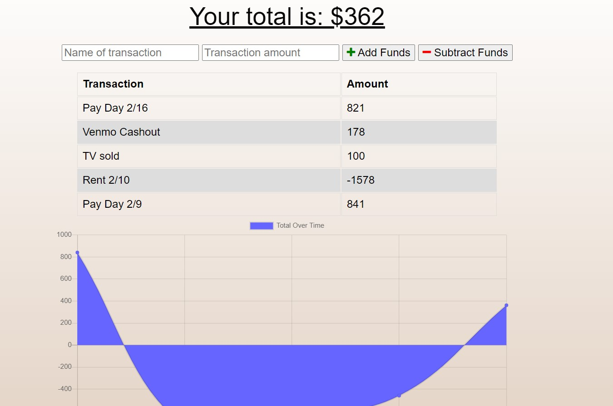

# Progressive Budget

## Description 

Use this to track your revenue and expenses. It's strength is in the visual chart you get of your total over time. That way you can see the highs and lows of your expenses.

## Installation

Click the link above and use the app through Heroku.

## Usage 

Simply name the transaction, put in the ammount, and press either the add or subtract button to update the transaction list and Total Over Time chart simultaneously.

## Credits

I would like to give a lot of credit to my TA Leigh Tracey she helped understand the concepts needed for this assignment. Also my tutor Phil Loy gave me a lot of pointers with the Javascript.

